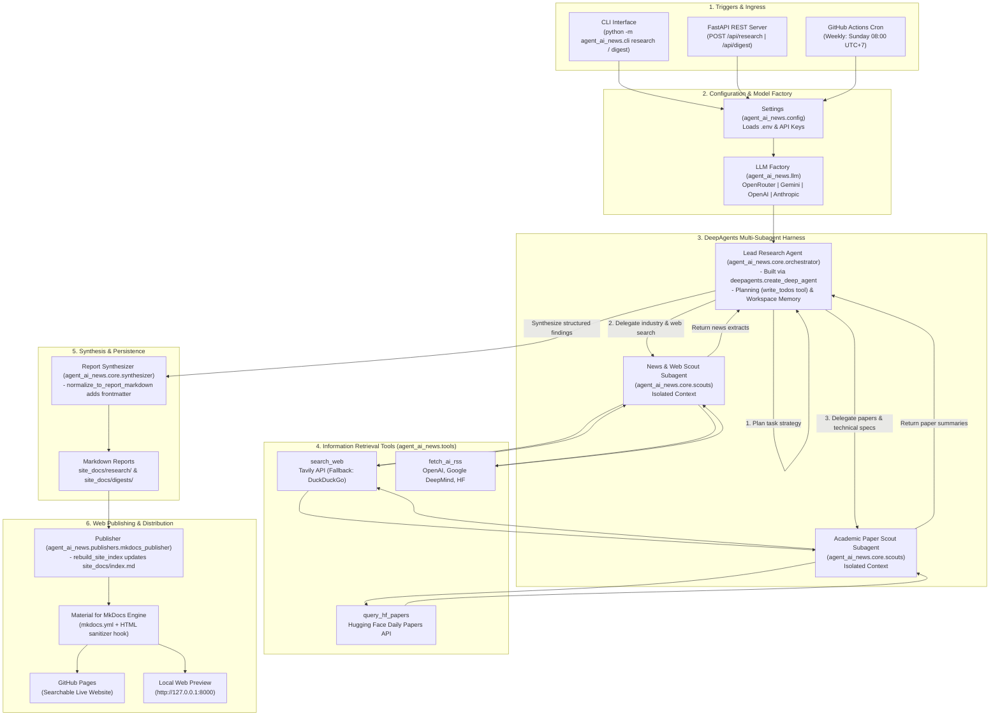

# agent-ai-news: AI Intelligence Research & Digest Agent

An autonomous research and intelligence agent powered by LangChain's **`deepagents`** harness. It continuously discovers, filters, and synthesizes breaking Artificial Intelligence news, frontier model releases, research papers, and Hugging Face trending papers into structured briefings and publishes them to a searchable web portal.

---

## 🌟 Key Features

* **Lead Orchestrator (DeepAgent):** Leverages `deepagents`' native planning (`write_todos`), workspace isolation, and subagent delegation.
* **Specialized Subagents:**
  - **News & Web Scout:** Searches breaking AI releases and lab blogs via Tavily (with automatic DuckDuckGo fallback) and parsed AI lab RSS feeds (OpenAI, Google DeepMind, Hugging Face).
  - **Academic Paper Scout:** Queries Hugging Face daily papers and searches the web for research papers, technical breakdowns, and benchmark findings.
* **Provider-Agnostic LLM Engine:** Supports **OpenRouter**, **Google Gemini**, **OpenAI**, and **Anthropic** with auto-detection.
* **Material for MkDocs Publishing:** Automatically converts briefings into a searchable, mobile-ready static website with dark mode. Every page is sanitized at build time, so HTML or scripts picked up from the web can never run on the published site.
* **Dual Interface:** Typer CLI for local interactive usage and FastAPI REST API for remote integration.
* **Automated CI/CD:** Ready for zero-cost weekly briefings on GitHub Actions and static site hosting on GitHub Pages.

---

## 🏗️ Architecture & End-to-End Workflow



---

## 🛠️ Prerequisites & Installation

Python 3.11 or higher is required.

```bash
# Clone the repository
git clone https://github.com/your-username/agent-ai-news.git
cd agent-ai-news

# Create and activate virtual environment
python3 -m venv .venv
source .venv/bin/activate

# Install package with web publishing and development tools
pip install -e ".[web,dev]"
```

---

## 🔑 Environment Variables Configuration

Copy `.env.example` to `.env` and fill in your preferred provider API keys:

```bash
cp .env.example .env
```

| Variable | Description | Default |
| :--- | :--- | :--- |
| `AGENT_LLM_PROVIDER` | Preferred provider: `openrouter`, `gemini`, `openai`, `anthropic` | Auto-detected from the API keys set (OpenRouter → Gemini → OpenAI → Anthropic) |
| `AGENT_MODEL_NAME` | Model ID (e.g. `anthropic/claude-sonnet-5`, `gemini-3.6-flash`, `gpt-4o`) | Provider default |
| `OPENROUTER_API_KEY` | OpenRouter API Key (access Claude, DeepSeek, Llama, etc.) | Optional |
| `OPENROUTER_PROVIDERS` | Preferred OpenRouter inference provider(s) (e.g. `Together,DeepInfra`); alias `OPENROUTER_PROVIDER` | Optional |
| `OPENROUTER_ALLOW_FALLBACKS` | Allow OpenRouter fallbacks if preferred provider unavailable (`true`/`false`) | `true` |
| `GOOGLE_API_KEY` | Google Gemini API Key; alias `GEMINI_API_KEY` | Optional |
| `OPENAI_API_KEY` | OpenAI API Key | Optional |
| `ANTHROPIC_API_KEY` | Anthropic Claude API Key | Optional |
| `TAVILY_API_KEY` | Tavily Web Search API Key (auto-falls back to DuckDuckGo if unset) | Optional |
| `AGENT_API_KEY` | Key API clients must send in the `X-API-Key` header. If unset, the server generates a temporary key at startup and prints it | Generated per process |
| `SITE_DOCS_DIR` | MkDocs source directory; reports are saved to its `research/` and `digests/` subfolders (relative paths resolve from the project root) | `site_docs` |
| `LLM_TIMEOUT_SECONDS` / `LLM_MAX_RETRIES` | Per-request LLM timeout and retry count | `120` / `2` |
| `AGENT_RECURSION_LIMIT` | Maximum agent steps before a run is stopped | `200` |
| `PROGRESS_HEARTBEAT_SECONDS` | Interval of the "still running" progress log line | `30` |

---

## 💻 CLI Usage

The package provides the `agent-ai-news` CLI entrypoint (or `python -m agent_ai_news.cli`).

Each run logs every LLM and tool call, plus a "still running" line every 30 seconds. Global options go before the command: `-v` / `--verbose` adds debug logs (every HTTP request), `-q` / `--quiet` hides the progress log. `research` and `digest` also accept `--openrouter-provider "Together,DeepInfra"` to prefer specific OpenRouter inference providers for that run:
```bash
agent-ai-news -q digest --days 7 --openrouter-provider "Together,DeepInfra"
```

### 1. Interactive On-Demand Research
Run a deep-dive research query on any specific AI topic:
```bash
agent-ai-news research "Emerging techniques in test-time compute and reasoning models"
# Or:
python -m agent_ai_news.cli research "Emerging techniques in test-time compute and reasoning models"
```

### 2. Automated Daily / Weekly Digest
Generate an intelligence briefing across web, lab RSS, and Hugging Face:
```bash
# Generate daily briefing (past 24h)
agent-ai-news digest --days 1 --topic "Frontier LLMs, Open Weights, Robotics"

# Generate weekly briefing (past 7 days)
agent-ai-news digest --days 7
```

### 3. Static Web Portal Preview
Every `research` / `digest` run saves its report into `site_docs/` and updates the archive index automatically. To rebuild the index manually (e.g. after editing or deleting a report) and start a local MkDocs preview:
```bash
agent-ai-news publish --serve
```
Visit `http://127.0.0.1:8000` to browse your searchable intelligence portal.

### 4. Launch FastAPI REST Server
```bash
agent-ai-news serve --port 8000               # listens on 127.0.0.1 only
agent-ai-news serve --host 0.0.0.0 --port 8000  # accept remote connections
```

---

## 🌐 FastAPI REST API

When running the web server (`uvicorn agent_ai_news.server:app` or `agent-ai-news serve`), the following endpoints are available.

Every `/api/*` call can spend LLM credits, so it requires the `X-API-Key` header matching `AGENT_API_KEY`. If `AGENT_API_KEY` is not set, the server generates a temporary key at startup and prints it in its log. Set a fixed key for any shared or deployed server:

```bash
python -c "import secrets; print(secrets.token_urlsafe(32))"   # put the output in .env as AGENT_API_KEY
curl -X POST http://127.0.0.1:8000/api/research \
  -H "X-API-Key: $AGENT_API_KEY" -H "Content-Type: application/json" \
  -d '{"query": "Recent multimodal vision-language models"}'
```

* `GET /health`: Health verification endpoint (`{"status": "ok"}`); no API key needed.
* `POST /api/research`: Trigger on-demand research (`query`: 3-500 characters; optional `openrouter_provider`, as in the CLI option):
  ```json
  {
    "query": "Recent multimodal vision-language models"
  }
  ```
* `POST /api/digest`: Compile scheduled briefing (`days`: 1-365, up to 10 `topics` of at most 100 characters; optional `openrouter_provider`):
  ```json
  {
    "days": 1,
    "topics": ["Reasoning", "Open Weights"]
  }
  ```
* `GET /api/reports`: List all reports in `site_docs/research/` and `site_docs/digests/`.
* `GET /api/reports/{filename}`: Return one report's markdown as JSON (`filename`, `content`).

Interactive Swagger documentation is available at `http://localhost:8000/docs` (click **Authorize** and enter the API key to try the `/api` endpoints).

---

## 🚀 Deployment Guide

You can deploy and host this agent using three primary methods:

### Option A: Zero-Cost Automated Scheduled Briefings (GitHub Actions + GitHub Pages)
This repository includes two workflows that run completely free on GitHub's infrastructure: `.github/workflows/ai-digest.yml` generates the weekly briefing, and `.github/workflows/deploy-site.yml` builds `site_docs/` with MkDocs and publishes it to GitHub Pages:

1. Push your repository to GitHub.
2. In your GitHub repository, go to **Settings** $\rightarrow$ **Secrets and variables** $\rightarrow$ **Actions**.
3. Add your API keys as Repository Secrets:
   - `OPENROUTER_API_KEY` (or `GOOGLE_API_KEY` / `OPENAI_API_KEY` / `ANTHROPIC_API_KEY`)
   - `TAVILY_API_KEY` (optional)
   - `AGENT_LLM_PROVIDER` (optional; if unset, the provider is auto-detected from the API key secret)
4. Go to **Settings** $\rightarrow$ **Pages** $\rightarrow$ **Build and deployment** and set **Source** to **GitHub Actions**. (With `Deploy from a branch`, GitHub renders this README instead of the site.)
5. The digest workflow runs every Sunday at `08:00 UTC+7` (`01:00 UTC`; GitHub schedules use UTC): it generates a briefing covering the past 7 days, commits it to the repository, and then deploys the site to **GitHub Pages**. You can also trigger it manually from the **Actions** tab, where `days` defaults to 7.
6. The site is also redeployed whenever a push to `main` changes `site_docs/` or `mkdocs.yml` (for example, reports you generate locally and push), or when you run **Deploy Site to GitHub Pages** manually from the **Actions** tab.

#### Choosing the LLM Model (`AGENT_MODEL_NAME`)
The workflow reads the model from the `AGENT_MODEL_NAME` repository variable. If the variable is not set, it defaults to empty and digests use the provider's default model (`anthropic/claude-sonnet-5` on OpenRouter). To use another model:

1. Go to **Settings** $\rightarrow$ **Secrets and variables** $\rightarrow$ **Actions** $\rightarrow$ **Variables** tab $\rightarrow$ **New repository variable**:
   - Name: `AGENT_MODEL_NAME`
   - Value: a model ID for your provider, e.g. `deepseek/deepseek-v4.1-flash` (OpenRouter IDs use the `vendor/model` form)

   It is a variable rather than a secret: the model name is not sensitive, and secrets are masked as `***` in the logs.
2. *(Optional)* To use a different model for a single manual run, go to **Actions** $\rightarrow$ **Weekly AI Intelligence Briefing & Site Publish** $\rightarrow$ **Run workflow** and fill in the **model** field. Leave it blank to use the variable.

The model is resolved in this order: `model` input $\rightarrow$ `AGENT_MODEL_NAME` variable $\rightarrow$ provider default. The model ID must match the provider in use: the `AGENT_LLM_PROVIDER` secret, or the provider auto-detected from your API key secret.

### Option B: Docker & Docker Compose
To run the agent API server in a self-hosted container (it runs as a non-root user). Set `AGENT_API_KEY` in `.env` first; otherwise the key changes on every restart and is printed in the container logs:

```bash
# Build and run with Docker Compose
docker compose up -d

# View logs
docker compose logs -f
```

To run a one-off CLI command inside Docker:
```bash
docker compose run --rm agent-api python -m agent_ai_news.cli digest --days 1
```

### Option C: Cloud Container Platforms (Google Cloud Run / Railway / Fly.io)
Deploy the containerized FastAPI server to serverless container hosts:

* **Google Cloud Run:** keep keys in Secret Manager rather than plain env vars. `AGENT_API_KEY` must be set: each instance would otherwise generate its own key.
  ```bash
  gcloud run deploy agent-ai-news \
    --source . \
    --port 8000 \
    --allow-unauthenticated \
    --set-secrets OPENROUTER_API_KEY=openrouter-api-key:latest,AGENT_API_KEY=agent-api-key:latest
  ```
* **Railway / Fly.io:** Connect your repository, add environment variables (including `AGENT_API_KEY`), and the included `Dockerfile` will automatically build and launch the API server.

---

## 🧪 Testing

Run the full automated test suite with `pytest`:

```bash
pytest tests/ -v
```

---

## 📄 License
MIT License.
