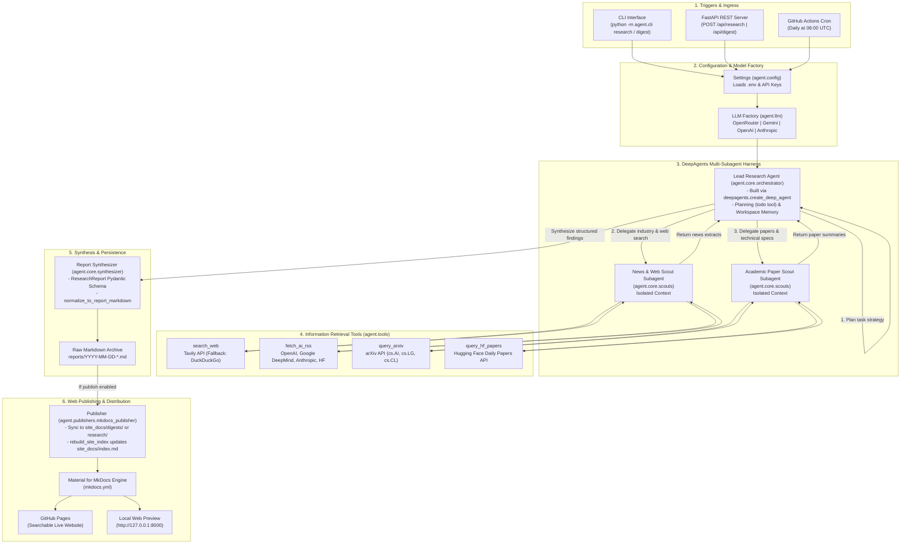

# AI Intelligence Research & Digest Agent

An autonomous research and intelligence agent powered by LangChain's **`deepagents`** harness. It continuously discovers, filters, and synthesizes breaking Artificial Intelligence news, frontier model releases, arXiv preprints, and Hugging Face trending papers into structured briefings and publishes them to a searchable web portal.

---

## 🌟 Key Features

* **Lead Orchestrator (DeepAgent):** Leverages `deepagents`' native planning (`todo`), workspace isolation, and subagent delegation.
* **Specialized Subagents:**
  - **News & Web Scout:** Searches breaking AI releases and lab blogs via Tavily (with automatic DuckDuckGo fallback) and parsed AI lab RSS feeds (OpenAI, Google DeepMind, Anthropic, Hugging Face).
  - **Academic Paper Scout:** Queries arXiv API and Hugging Face daily papers for technical breakdowns and benchmark findings.
* **Provider-Agnostic LLM Engine:** Supports **OpenRouter**, **Google Gemini**, **OpenAI**, and **Anthropic** with auto-detection.
* **Material for MkDocs Publishing:** Automatically converts briefings into a searchable, mobile-ready static website with dark mode and tags.
* **Dual Interface:** Typer CLI for local interactive usage and FastAPI REST API for remote integration.
* **Automated CI/CD:** Ready for zero-cost daily briefings on GitHub Actions and static site hosting on GitHub Pages.

---

## 🏗️ Architecture & End-to-End Workflow



---

## 🛠️ Prerequisites & Installation

Python 3.11 or higher is required.

```bash
# Clone the repository
git clone https://github.com/your-username/agent.git
cd agent

# Create and activate virtual environment
python3 -m venv .venv
source .venv/bin/activate

# Install package with web publishing and development tools
pip install -e ".[web,dev]"
```

---

## 🔑 Environment Variables Configuration

Copy `.env.example` to `.env` and fill in your preferred provider API keys:

```bash
cp .env.example .env
```

| Variable | Description | Default |
| :--- | :--- | :--- |
| `AGENT_LLM_PROVIDER` | Preferred provider: `openrouter`, `gemini`, `openai`, `anthropic` | `openrouter` (auto-detected) |
| `AGENT_MODEL_NAME` | Model ID (e.g. `anthropic/claude-3.5-sonnet`, `gemini-2.0-flash`, `gpt-4o`) | Provider default |
| `OPENROUTER_API_KEY` | OpenRouter API Key (access Claude, DeepSeek, Llama, etc.) | Optional |
| `GOOGLE_API_KEY` | Google Gemini API Key | Optional |
| `OPENAI_API_KEY` | OpenAI API Key | Optional |
| `ANTHROPIC_API_KEY` | Anthropic Claude API Key | Optional |
| `TAVILY_API_KEY` | Tavily Web Search API Key (auto-falls back to DuckDuckGo if unset) | Optional |
| `REPORTS_DIR` | Directory to save raw Markdown reports | `reports` |
| `SITE_DOCS_DIR` | Source directory for MkDocs documentation | `site_docs` |

---

## 💻 CLI Usage

The package provides the `ai-agent` CLI entrypoint (or `python -m agent.cli`):

### 1. Interactive On-Demand Research
Run a deep-dive research query on any specific AI topic:
```bash
python -m agent.cli research "Emerging techniques in test-time compute and reasoning models"
```

### 2. Automated Daily / Weekly Digest
Generate an intelligence briefing across web, lab RSS, arXiv, and Hugging Face:
```bash
# Generate daily briefing (past 24h)
python -m agent.cli digest --days 1 --topic "Frontier LLMs, Open Weights, Robotics"

# Generate weekly briefing (past 7 days)
python -m agent.cli digest --days 7
```

### 3. Static Web Portal Preview
Rebuild the documentation archive and start a local MkDocs preview:
```bash
python -m agent.cli publish --serve
```
Visit `http://127.0.0.1:8000` to browse your searchable intelligence portal.

### 4. Launch FastAPI REST Server
```bash
python -m agent.cli serve --host 0.0.0.0 --port 8000
```

---

## 🌐 FastAPI REST API

When running the web server (`uvicorn agent.server:app` or `python -m agent.cli serve`), the following endpoints are available:

* `GET /health`: Health verification endpoint (`{"status": "ok"}`).
* `POST /api/research`: Trigger on-demand research:
  ```json
  {
    "query": "Recent multimodal vision-language models",
    "publish": true
  }
  ```
* `POST /api/digest`: Compile scheduled briefing:
  ```json
  {
    "days": 1,
    "topics": ["Reasoning", "Open Weights"],
    "publish": true
  }
  ```
* `GET /api/reports`: List all generated reports.
* `GET /api/reports/{filename}`: Download/view specific report markdown.

Interactive Swagger documentation is available at `http://localhost:8000/docs`.

---

## 🚀 Deployment Guide

You can deploy and host this agent using three primary methods:

### Option A: Zero-Cost Automated Scheduled Briefings (GitHub Actions + GitHub Pages)
This repository includes `.github/workflows/ai-digest.yml`, which runs completely free on GitHub's infrastructure:

1. Push your repository to GitHub.
2. In your GitHub repository, go to **Settings** $\rightarrow$ **Secrets and variables** $\rightarrow$ **Actions**.
3. Add your API keys as Repository Secrets:
   - `OPENROUTER_API_KEY` (or `GOOGLE_API_KEY` / `OPENAI_API_KEY`)
   - `TAVILY_API_KEY` (optional)
4. Go to **Settings** $\rightarrow$ **Pages** and set **Source** to `Deploy from a branch` (branch: `gh-pages` / root).
5. The workflow automatically executes every morning at `08:00 UTC`, generates the new briefing, commits it to the repository, and publishes the static website to **GitHub Pages**. You can also trigger it manually from the **Actions** tab.

### Option B: Docker & Docker Compose
To run the agent API server in a self-hosted container:

```bash
# Build and run with Docker Compose
docker compose up -d

# View logs
docker compose logs -f
```

To run a one-off CLI command inside Docker:
```bash
docker run --rm --env-file .env ai-intelligence-agent python -m agent.cli digest --days 1
```

### Option C: Cloud Container Platforms (Google Cloud Run / Railway / Fly.io)
Deploy the containerized FastAPI server to serverless container hosts:

* **Google Cloud Run:**
  ```bash
  gcloud run deploy ai-agent \
    --source . \
    --port 8000 \
    --allow-unauthenticated \
    --set-env-vars OPENROUTER_API_KEY=your_key
  ```
* **Railway / Fly.io:** Connect your repository, add environment variables, and the included `Dockerfile` will automatically build and launch the API server.

---

## 🧪 Testing

Run the full automated test suite with `pytest`:

```bash
pytest tests/ -v
```

---

## 📄 License
MIT License.
